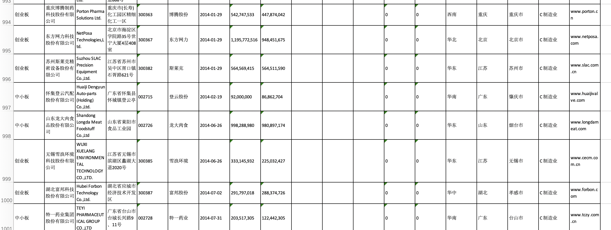
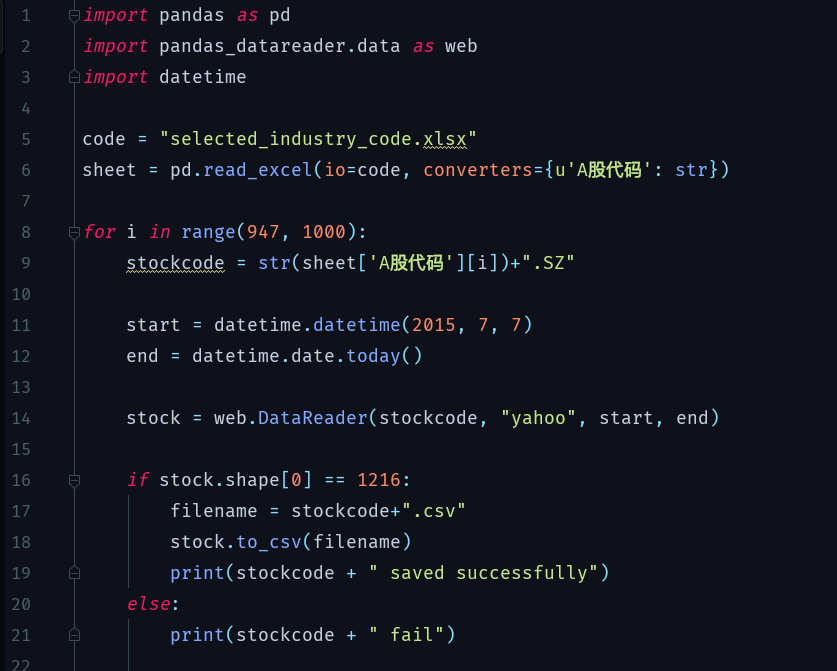
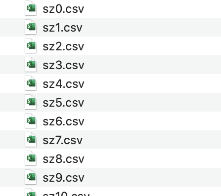
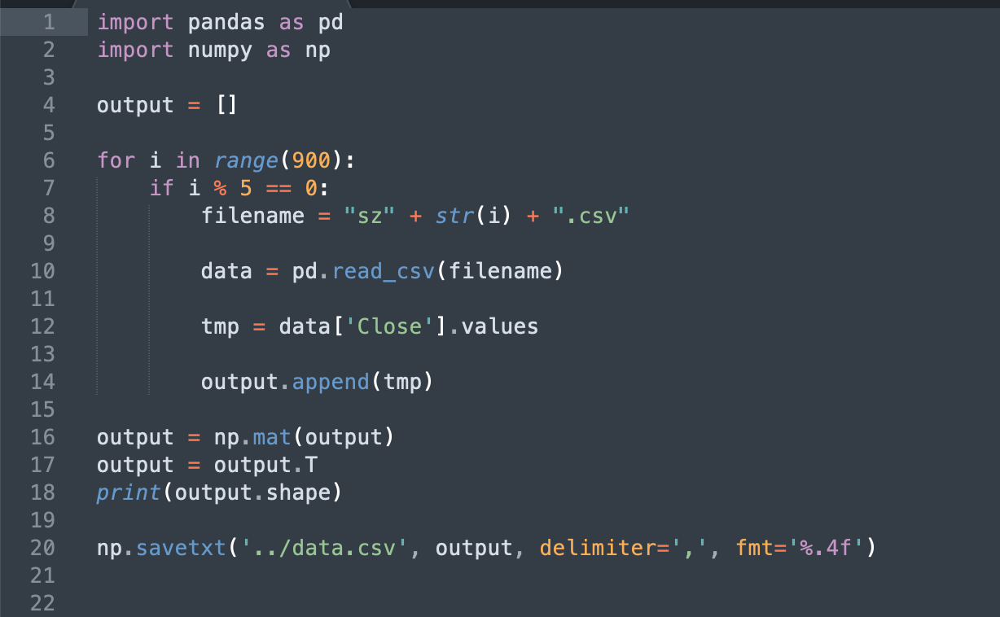

# DeepStock

本项目主要设计了一套利用深度学习对股票数据进行分析预测的流程，目前只是简单针对一个股票进行分析，主要的分析思路是，利用神经网络分析前150个交易日大量股票的变化模式，从而预测未来10个交易日预测对象的变化，思想上接近模式分析而不是以往的时间序列分析，当然模型可以随意修改，本项目的重点在于展示如何或许数据、如何预处理、如何输入到模型进行分析。

 

需要说明的是，本人对股票完全不了解，只是随便写来玩玩，仅当娱乐。

 

####数据预处理

以分析**000636.SZ风华高科**为例，这是一个在深圳交易所上市的股票，同时它属于制造业领域，所以在深圳交易所（http://www.szse.cn/market/stock/list/）筛选出制造业领别的A股代码数据下载下来。

 

不同的股票有不同的上市日期，比如说我们可能希望模型的训练集包含近六年的数据，那么上市日期就不能晚于2014年7月，那么我们就需要对下载下来的数据进行筛选，这个可以用excel实现

到目前为止，我们就得到了深圳交易所制造业在2014年7月31号前上市的所有股票代码信息，然后我们就可以利用这些代码把这些股票的这几年的价格数据下载下来，主要利用pandas_datareader.data，可以在网上搜索一下相关的资料

其实我们就是利用它在雅虎金融上下载股票数据，这样下载下来的数据包括了开市最高最低收市等等的价格信息。为了方便后续的处理，我对下载下来的文件重命名了一下，目标预测的股票命名为sz0（风华高科），其他就随便从sz1开始命名下去：

这样一大堆文件分析的时候读取耗时，而且每个文件包含了开市收市最高最低价等信息，这里我也用不到那么多数据，所以我只是抽取了每个股票的收市价格（“Close”），每个股票一列数据，然后把所有股票的数据整理在一起，最后就得到了一个1216\*900的矩阵，1216表示一个股票这六年的所有数据，900表示一个有900个股票（下面的代码我做了一个判断，每间隔5个股票保存一次数据，最后得到1216\*160的矩阵，是因为我的电脑跑不了那么多数据……）：

到这里，就完成了数据的预处理。

 

####建模与分析

处理好数据其实是关键，后续的建模分析其实五花八门，我只说一下我个人的想法。首先我认为利用深度学习对股票进行时间序列分析是不现实的，比如说谁也不会想到今年会发生COVID-19，这么突然的事情不可能通过历史的数据分析出来，既然如此在发生COVID-19之后股票的变化就更不可能预测出来了，所以通过历史数据预测未来数据是不现实的，但是我觉得或许可以尝试一下通过历史的模式预测未来的变化，比如说发生COVID-19的时候股票ABC的变化模式和当年非典的时候非常接近（比如说都在一周内价格下降了50%），然后模型就可以基于当年模式去预测我们的目标股票D的变化。另一方面，如果一个股票历史数据从来没有超越过30元，那么模型也很大概率会认为这个股票价格未来不会超过30元，为了避免这种情况，我们的预测output应该是股票今天相对于前一天的价格变化，通过这些变化再换算成股票的价格。

 

因为针对模式而不是序列进行分析，所以模型上主要采用卷积层进行特征提取，其实我也只是随便写了几个卷积层，毕竟写得太复杂我的电脑也跑步起来，大家可以按着这个思路进一步完善模型，也可以按照自己的思路进行分析。

